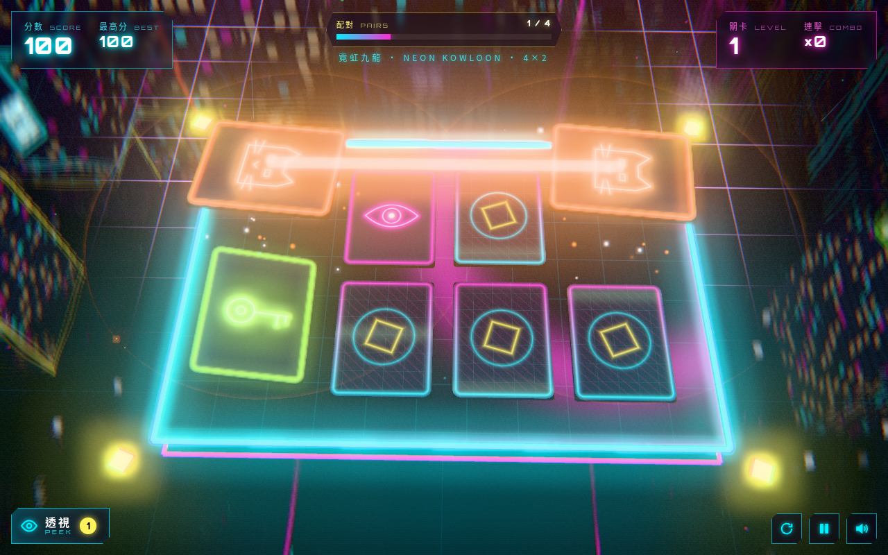

# 霓虹記憶 NEON RECALL

> 賽博朋克 3D 記憶配對 · cyberpunk 3D memory match · Three.js · 手機優先

**試玩 Play:** https://fung2222.github.io/neon-recall/ · **自動示範 Demo:** https://fung2222.github.io/neon-recall/?demo=1



## 玩法 How to play
- 每關開始會**預覽**所有卡牌幾秒，記住佢哋。
- 點卡牌翻開，兩張一樣就**配對成功**；連續配對有**連擊**加分（最高 ×5）。
- 冇時間限制、冇得輸。失誤越少，星星越多（最多 ★★★）。
- 關卡由 4×2 逐步變大到 6×4；第 7 關起，失誤後可能出現**數據錯亂**：兩張蓋住嘅卡會互換位置！
- **透視 PEEK**：短暫睇晒所有卡。每 3 關送 1 次；用完可補充（網頁版免費；App 版用自願觀看嘅獎勵廣告）。

## 操作 Controls
| 動作 | 手機 | 鍵盤 / 滑鼠 |
|---|---|---|
| 翻卡 Flip | 點擊 Tap | 點擊 / 方向鍵揀卡 + Enter |
| 透視 Peek | 透視掣 | Z |
| 重玩此關 Restart | ⟳ | R |
| 暫停 Pause | ⏸ | P / Esc |
| 靜音 Mute | 🔊 | M |

## 網址參數 URL flags
`?demo=1` AI 自動玩 · `?level=5` 由第 5 關開始 · `?seed=1` · `?fps=1` · `?quality=low` · `?adsim=1` · `?reset=1`

## 技術 Tech
Three.js r169 + [cyber-kit](https://github.com/fung2222/cyber-kit) v0.1.0（`vendor/cyber-kit/`），純 ES modules，冇 build step，可離線運行。16 個原創霓虹圖示全部用 canvas 程式繪製。

## 開發 Development
```bash
cd .. && python3 -m http.server 18940     # 開 http://127.0.0.1:18940/neon-recall/
node neon-recall/tests/logic.test.mjs
python neon-recall/tests/smoke.py
```
文件：[docs/HANDOFF.md](docs/HANDOFF.md) · [privacy.html](privacy.html) · 屬於 [CYBER ARCADE](https://github.com/fung2222/cyber-arcade) 系列。
